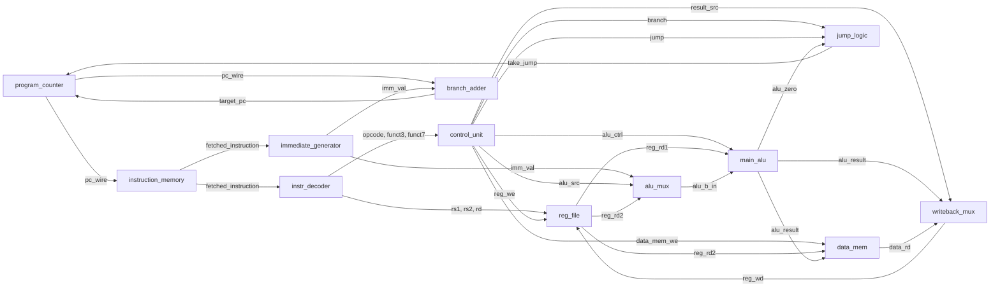
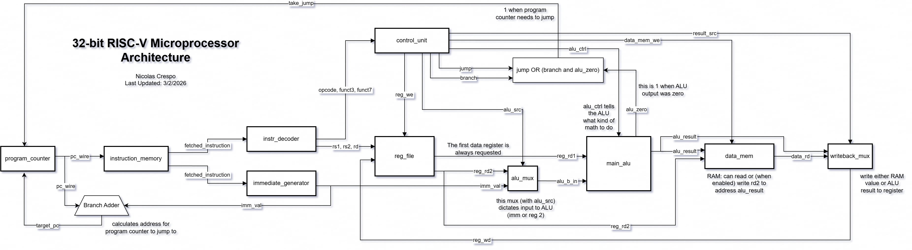

# 32-bit RISC-V Microprocessor

## Project Overview

This project involves the design and implementation of a custom **32-bit RISC-V
microprocessor** (a subset of the RV32I architecture) on a **Basys3 FPGA
board**.

## Architecture Diagram

A more human friendly version:

## Technical Specifications

- **Architecture**: 32-bit RISC-V (RV32I subset).
- **Instruction Set**:
  - **Arithmetic**: `ADD`, `SUB`, `ADDI`, `AND`, `OR`.
  - **Memory**: `LW` (Load Word), `SW` (Store Word).
  - **Control Flow**: `BEQ` (Branch if Equal), `JAL` (Jump and Link).
  - **Special**: `WAIT` (hardware pause), `END` (halt).
- **Hardware Platform**: Xilinx Artix-7 FPGA (Basys3).
- **I/O Integration**:
  - **UART**: 8-bit to 32-bit instruction stitching for program uploading.
  - **Display**: 4-digit 7-segment display for debugging and state visualization.
  - **Controls**: Debounced switches and buttons for system reset and manual execution steps.

## Project Structure

- **`/assembler`**: A two-pass Python assembler that translates `.s` assembly files into 32-bit machine code binaries.
- **`/hardware/src`**: Verilog source files including the ALU, Register File (with hardwired `x0`), Control Unit, and UART receiver.
- **`/hardware/constraints`**: XDC files for Basys3 pin mapping.

## Key Features

- **Two-Pass Assembler**: Supports text labels and relative address calculation
  for branching and jumps.
- **Serial Programming**: Programs are compiled on a PC and streamed to the
  FPGA's block RAM via UART.
- **On-Board Debugging**: A dedicated "Debug Mode" allows for real-time
  inspection of the Program Counter and internal register states using the FPGA's
  LEDs and 7-segment display.

## Contributors

- **Nicolas Crespo**: Software Toolchain (Assembler), UART Integration, and Peripheral Controllers.
- **Frank Longwang**: CPU Core Architecture, ALU Design, and Instruction Decoding.

---

_Developed for CS M152A W26_
