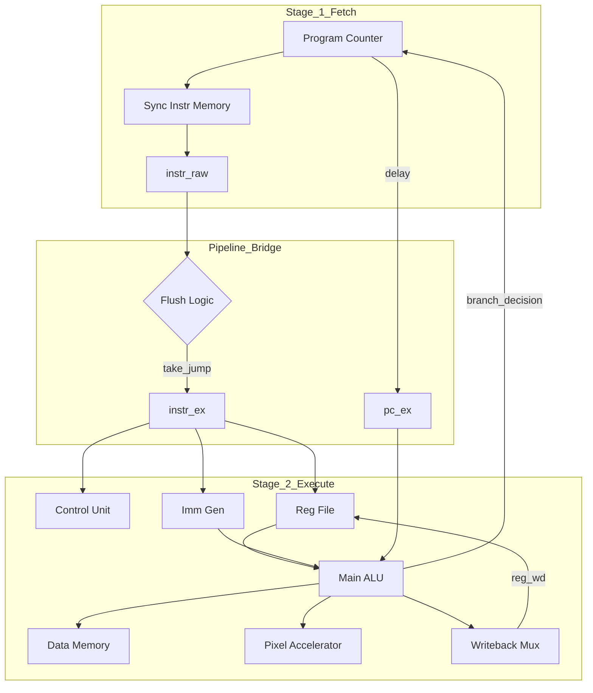

<div align="center">

# 32-bit RISC-V Pipelined Microprocessor

A high-performance, pipelined RISC-V processor core designed for deployment on the Xilinx Artix-7 FPGA, featuring dynamic instruction loading and hardware acceleration.

</div>

## Project Overview

This project implements a custom 32-bit RISC-V microprocessor based on the RV32I ISA. The core utilizes a 2-stage pipeline (Fetch/Execute) to maximize clock frequency and throughput. It is optimized for the Basys3 FPGA, leveraging its Synchronous Block RAM (BRAM) for instruction storage and a UART Snooper for live code deployment.

## Architecture Diagram

The processor is divided into two concurrent stages. The pipeline bridge handles control hazards through hardware flushing and ensures data synchronization between the fetch cycle and the ALU.



## Key Features

- **2-Stage Pipeline**: Decouples instruction fetching from execution, allowing processor to utilize high-speed Synchronous BRAM.
- **Dynamic UART Snooper**: A custom UART receiver allows users to put instructions into memory at runtime, bypassing the need for full FPGA re-synthesis during development.
- **Hardware Acceleration:** Includes a memory-mapped **Pixel Processor** for offloading compute-intensive graphical tasks.

## Getting Started

### 1. Requirements

- RISC-V Toolchain: `riscv64-unknown-elf-` for assembling `.s` files.
- Simulator: `iverilog` or Xilinx Vivado 2025.2+.

### 2. Running Simulations

The project includes a robust automated testing suite managed via `Makefile`:

```bash
# Run the full RV32I regression suite
make test_regression

# Run the Fibonacci sequence functional test
make test_fib
```

### 3. FPGA Deployment

To generate the bitstream and program the Basys3 board:

```bash
make bitstream
make program
```

<div align="center">
<sub>Developed for CS M152A</sub>
</div>
